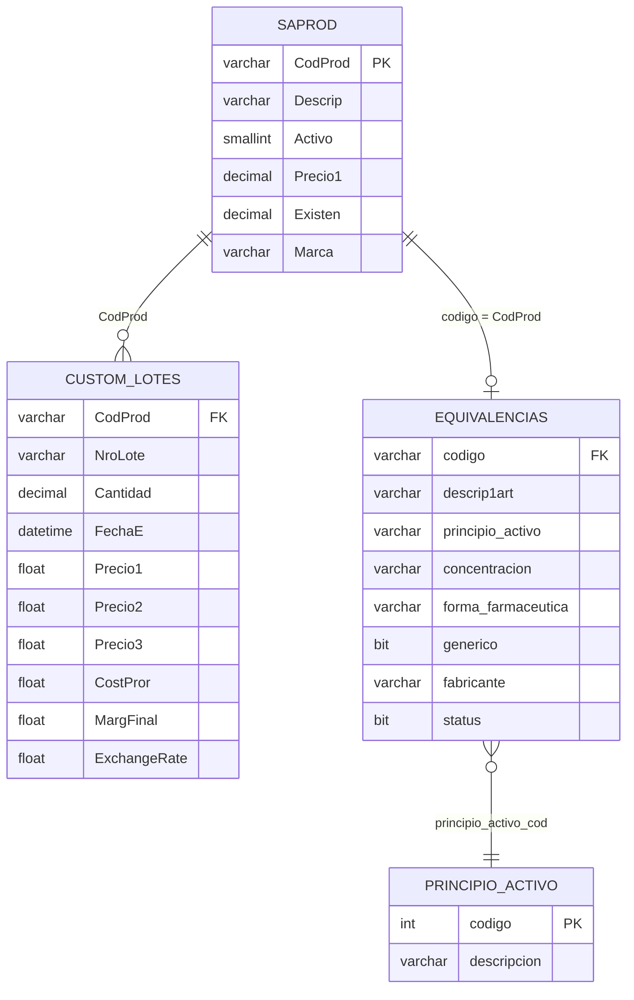

# 🏥 Queries SQL para Agente WhatsApp - Farmacia Americana

> **Base de datos:** Saint Enterprise (SQL Server)
> **Vistas clave:** `dbo.CUSTOM_LOTES`, `dbo.SAPROD`
> **Tabla farmacéutica:** `Procurement.equivalencias`
> **Estado:** Producción

---

## A. Consulta de Stock y Precios (Disponibilidad Inmediata)

**Caso:** El cliente pregunta por WhatsApp: *"¿Tienen amoxicilina?"*
**Fuente:** Vista `CUSTOM_LOTES` + tabla maestra `SAPROD`

```sql
-- ═══════════════════════════════════════════════════════
-- QUERY A: Stock por nombre de producto (búsqueda flexible)
-- Parámetro: @busqueda = término del cliente (ej: 'amoxicilina')
-- ═══════════════════════════════════════════════════════
DECLARE @busqueda VARCHAR(100) = '%amoxicilina%';

SELECT 
    sp.CodProd          AS Codigo,
    sp.Descrip           AS Producto,
    cl.NroLote           AS Lote,
    cl.Cantidad          AS Stock_Disponible,
    cl.FechaE            AS Fecha_Vencimiento,
    cl.Precio1           AS Precio_Publico,
    cl.Precio2           AS Precio_Mayoreo,
    cl.Precio3           AS Precio_Especial,
    cl.CostPror          AS Costo_Promedio,
    cl.MargFinal         AS Margen_Pct
FROM dbo.CUSTOM_LOTES cl
INNER JOIN dbo.SAPROD sp ON cl.CodProd = sp.CodProd
WHERE sp.Descrip LIKE @busqueda
  AND cl.Cantidad > 0
  AND sp.Activo = 1
ORDER BY cl.Cantidad DESC;
```

> [!TIP]
> **Para el Agente n8n:** El modelo recibirá del cliente texto libre como "amoxicilina 500mg cápsulas". El LLM debe extraer el término clave y construir el `@busqueda` con wildcards. Si el cliente envía una **imagen del récipe**, Gemini Flash Lite la lee y extrae el nombre del medicamento antes de ejecutar esta query.

---

## B. Alerta de Vencimientos (Gestión Proactiva)

**Caso:** El agente internamente detecta lotes próximos a vencer para alertar al regente farmacéutico.
**Fuente:** Vista `CUSTOM_LOTES` + `SAPROD`

```sql
-- ═══════════════════════════════════════════════════════
-- QUERY B: Productos con lotes próximos a vencer (3 meses)
-- Sin parámetros: se ejecuta como tarea programada (cron)
-- ═══════════════════════════════════════════════════════
SELECT 
    sp.CodProd           AS Codigo,
    sp.Descrip           AS Producto,
    cl.NroLote           AS Lote,
    cl.Cantidad          AS Stock_Remanente,
    cl.FechaE            AS Fecha_Vencimiento,
    cl.Precio1           AS Precio_Actual,
    DATEDIFF(DAY, GETDATE(), cl.FechaE) AS Dias_Para_Vencer
FROM dbo.CUSTOM_LOTES cl
INNER JOIN dbo.SAPROD sp ON cl.CodProd = sp.CodProd
WHERE cl.Cantidad > 0
  AND sp.Activo = 1
  AND cl.FechaE <= DATEADD(MONTH, 3, GETDATE())
  AND cl.FechaE > GETDATE()  -- Excluir ya vencidos
ORDER BY cl.FechaE ASC;
```

> [!WARNING]
> **Producto vencido vs. próximo a vencer:** Los productos con `FechaE < GETDATE()` ya están vencidos y deberían aparecer en un reporte separado de destrucción. Esta query solo muestra los que están en la "zona de alerta" (0 a 90 días).

---

## C. Búsqueda de Stock Consolidado por Producto

**Caso:** El cliente solo quiere saber si hay stock, sin importar el lote.
**Fuente:** Vista `CUSTOM_LOTES` + `SAPROD` (agrupado)

```sql
-- ═══════════════════════════════════════════════════════
-- QUERY C: Stock total consolidado (sin desglose por lote)
-- Parámetro: @busqueda = término del cliente
-- ═══════════════════════════════════════════════════════
DECLARE @busqueda VARCHAR(100) = '%losartan%';

SELECT 
    sp.CodProd           AS Codigo,
    sp.Descrip           AS Producto,
    SUM(cl.Cantidad)     AS Stock_Total,
    MIN(cl.FechaE)       AS Lote_Mas_Proximo_Vencer,
    MAX(cl.FechaE)       AS Lote_Mas_Lejano,
    MIN(cl.Precio1)      AS Precio_Desde,
    MAX(cl.Precio1)      AS Precio_Hasta,
    COUNT(cl.NroLote)    AS Cantidad_Lotes
FROM dbo.CUSTOM_LOTES cl
INNER JOIN dbo.SAPROD sp ON cl.CodProd = sp.CodProd
WHERE sp.Descrip LIKE @busqueda
  AND cl.Cantidad > 0
  AND sp.Activo = 1
GROUP BY sp.CodProd, sp.Descrip
ORDER BY Stock_Total DESC;
```

> [!NOTE]
> **Para respuesta al cliente:** Esta query es la ideal para que el chatbot responda de forma limpia: *"Sí, tenemos Losartan 50mg disponible. Stock: 45 unidades. Precio: Bs. 1,200.00"* sin abrumarlo con detalles de lotes.

---

## D. Búsqueda de Alternativas Genéricas (Sustitución Terapéutica)

**Caso:** El cliente pide "Glucophage 850mg" pero no hay stock. El agente busca automáticamente alternativas con el mismo principio activo (Metformina 850mg).
**Fuente:** `Procurement.equivalencias` + `CUSTOM_LOTES` + `SAPROD`

```sql
-- ═══════════════════════════════════════════════════════
-- QUERY D: Buscar alternativas genéricas por principio activo
-- Parámetro: @codprod_original = código del producto sin stock
-- ═══════════════════════════════════════════════════════
DECLARE @codprod_original VARCHAR(50) = '00123';  -- CodProd del producto agotado

-- Paso 1: Obtener el principio activo y concentración del producto original
-- Paso 2: Buscar todos los productos con el mismo PA + concentración que tengan stock

SELECT 
    eq_alt.codigo        AS Codigo_Alternativa,
    eq_alt.descrip1art   AS Producto_Alternativa,
    eq_alt.fabricante    AS Laboratorio,
    eq_alt.generico      AS Es_Generico,
    sp.Existen           AS Stock_Saint,
    cl_stock.Stock_Total AS Stock_Por_Lotes,
    cl_stock.Precio_Min  AS Precio_Desde,
    cl_stock.Precio_Max  AS Precio_Hasta
FROM Procurement.equivalencias eq_orig
-- Buscar productos con mismo principio activo + concentración
INNER JOIN Procurement.equivalencias eq_alt 
    ON  eq_alt.principio_activo = eq_orig.principio_activo
    AND eq_alt.concentracion    = eq_orig.concentracion
    AND eq_alt.codigo          != eq_orig.codigo   -- Excluir el producto original
    AND eq_alt.status           = 1                -- Solo productos activos
-- Cruzar con SAPROD para verificar que exista en Saint
INNER JOIN dbo.SAPROD sp 
    ON eq_alt.codigo = sp.CodProd
    AND sp.Activo = 1
-- Cruzar con CUSTOM_LOTES para stock real por lote
LEFT JOIN (
    SELECT 
        CodProd,
        SUM(Cantidad)  AS Stock_Total,
        MIN(Precio1)   AS Precio_Min,
        MAX(Precio1)   AS Precio_Max
    FROM dbo.CUSTOM_LOTES 
    WHERE Cantidad > 0
    GROUP BY CodProd
) cl_stock ON eq_alt.codigo = cl_stock.CodProd
WHERE eq_orig.codigo = @codprod_original
  AND (sp.Existen > 0 OR cl_stock.Stock_Total > 0)  -- Al menos una fuente muestra stock
ORDER BY eq_alt.generico DESC, cl_stock.Precio_Min ASC;  -- Genéricos primero, luego por precio
```

> [!IMPORTANT]
> **Estado actual:** La tabla `Procurement.equivalencias` existe con el esquema correcto (`principio_activo`, `concentracion`, `forma_farmaceutica`, `generico`, `fabricante`) pero **está vacía**. Esta query funcionará perfectamente una vez se carguen los datos de equivalencias. Mientras tanto, la Query A (búsqueda directa por nombre) cubre el 80% de los casos.

---

## E. Búsqueda por Principio Activo (Alternativa Directa sin Tabla de Equivalencias)

**Caso:** Mientras `Procurement.equivalencias` se carga con datos, el agente puede buscar alternativas usando solo el texto del nombre del producto en SAPROD.

```sql
-- ═══════════════════════════════════════════════════════
-- QUERY E: Búsqueda por principio activo usando SAPROD (workaround)
-- Parámetro: @principio = principio activo extraído por el LLM
-- ═══════════════════════════════════════════════════════
DECLARE @principio VARCHAR(100) = '%metformina%';

SELECT 
    sp.CodProd           AS Codigo,
    sp.Descrip           AS Producto,
    sp.Marca             AS Marca,
    SUM(cl.Cantidad)     AS Stock_Total,
    MIN(cl.Precio1)      AS Precio_Desde,
    MAX(cl.Precio1)      AS Precio_Hasta
FROM dbo.SAPROD sp
INNER JOIN dbo.CUSTOM_LOTES cl ON sp.CodProd = cl.CodProd
WHERE sp.Descrip LIKE @principio
  AND cl.Cantidad > 0
  AND sp.Activo = 1
GROUP BY sp.CodProd, sp.Descrip, sp.Marca
ORDER BY Stock_Total DESC;
```

> [!TIP]
> **Inteligencia del LLM:** El modelo Llama 3.3 70B debe ser capaz de interpretar *"¿tienen algo para la presión?"* → extraer que el principio activo más común es "losartan" o "enalapril" → ejecutar esta query con esos términos. Esto es parte del RAG conversacional que conectaremos en n8n.

---

## F. Consulta de Precios en Divisas (USD)

**Caso:** El cliente pregunta *"¿Cuánto cuesta en dólares?"*
**Fuente:** Vista `CUSTOM_LOTES` (tiene precios en USD como `PrecioI1`, `PrecioI2`, `PrecioI3`)

```sql
-- ═══════════════════════════════════════════════════════
-- QUERY F: Precios en Bolívares y USD simultáneamente
-- Parámetro: @busqueda = término del cliente
-- ═══════════════════════════════════════════════════════
DECLARE @busqueda VARCHAR(100) = '%ibuprofeno%';

SELECT 
    sp.CodProd           AS Codigo,
    sp.Descrip           AS Producto,
    SUM(cl.Cantidad)     AS Stock,
    -- Precios en Bolívares
    MIN(cl.Precio1)      AS Precio_Bs,
    -- Precios en USD (campos PrecioI = Internacional/Divisa)
    MIN(cl.[Precio$ (per unit)]) AS Precio_USD,
    -- Tasa de cambio implícita
    MIN(cl.ExchangeRate) AS Tasa_Cambio
FROM dbo.CUSTOM_LOTES cl
INNER JOIN dbo.SAPROD sp ON cl.CodProd = sp.CodProd
WHERE sp.Descrip LIKE @busqueda
  AND cl.Cantidad > 0
  AND sp.Activo = 1
GROUP BY sp.CodProd, sp.Descrip
ORDER BY Precio_USD ASC;
```

---

## Mapa de Relaciones (Diccionario Visual)



---

## Próximos Pasos

- [ ] **Cargar datos en `Procurement.equivalencias`** para habilitar la Query D (sustitución genérica real)
- [ ] **Crear las "Tools" en n8n** que el Agente AI usará para ejecutar estas queries
- [ ] **Configurar el nodo MSSQL** en n8n con conexión al servidor Saint
- [ ] **Probar el flujo completo:** WhatsApp → Semáforo → Chatbot → SQL → Respuesta
